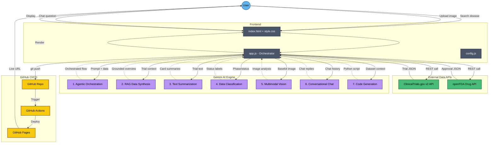
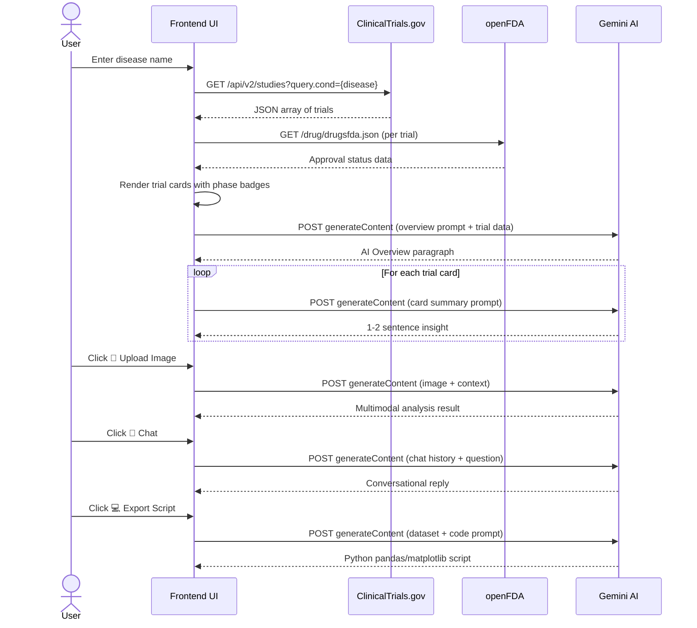
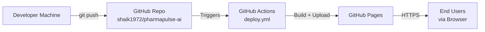

# 🏗️ PharmaPulse AI — Architecture & Design Document

## 📊 System Architecture

---

## 🔄 Data Flow Sequence

---

## 🧠 7 AI Capabilities — Deep Dive

### 1. Agentic Orchestration
The `runSearch()` function in `app.js` acts as the AI agent — it sequences API calls, manages loading states, handles errors, and triggers parallel AI requests without human intervention.

### 2. RAG (Retrieval-Augmented Generation)
Real-time data from ClinicalTrials.gov and openFDA is injected directly into Gemini prompts. This means Gemini's responses are grounded in live, factual data rather than relying solely on its training data.

### 3. Text Summarization
Each trial card gets a Gemini-generated 1-2 sentence summary, and the overall disease landscape gets a comprehensive AI overview — distilling complex medical jargon into accessible language.

### 4. Data Classification
The system classifies trials by phase (1-4), status (Recruiting/Active/Completed), and FDA approval state. The `filterPhase()` function enables dynamic filtering of classified data.

### 5. Multimodal AI (Vision)
Users can upload medical images (charts, structures, diagrams). The image is converted to Base64 and sent to Gemini's vision endpoint alongside a contextual prompt tied to the current disease search.

### 6. Conversational AI (Chatbot)
A persistent chat sidebar maintains conversation history and sends it with each new message to Gemini, providing context-aware responses about the currently displayed trials.

### 7. Code Generation
Gemini generates a complete Python analysis script using pandas and matplotlib, pre-loaded with the exact trial dataset currently displayed. Users can copy and run it locally.

---

## 📂 File Structure

| File | Purpose | Lines |
|------|---------|-------|
| `index.html` | Page structure, semantic HTML, all UI containers | ~190 |
| `style.css` | Dark glassmorphism theme, animations, responsive layout | ~560 |
| `app.js` | All application logic, API calls, AI integrations | ~680 |
| `config.js` | API endpoints, model name, feature flags | ~15 |
| `deploy.yml` | GitHub Actions workflow for auto-deploy to Pages | ~30 |

---

## 🌐 Deployment Architecture

**URL**: `https://shaik1972.github.io/pharmapulse-ai/`

---

## 🔐 Security

- Gemini API key is stored in `sessionStorage` (browser-only, per-session)
- Key is never committed to source code or environment files
- User is prompted on first visit; key is cleared when browser tab closes
- `.gitignore` excludes any `.env` files as a safety net
