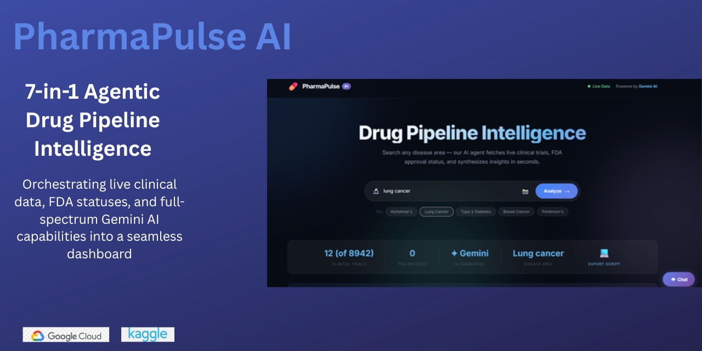

# 💊 PharmaPulse AI

> AI-powered drug pipeline intelligence dashboard — Track clinical trials, FDA approvals, and get Gemini AI insights on any disease area in real time.

  



## 🎯 What It Does

Search any disease area and PharmaPulse AI will:
- 🔬 **Fetch live clinical trials** from ClinicalTrials.gov
- 📋 **Check FDA approval status** via openFDA
- 🤖 **Synthesize AI insights** using Google Gemini
- 📸 **Analyze medical images** with Gemini Vision (Multimodal)
- 💬 **Chat with an AI assistant** about your results (Conversational AI)
- 💻 **Generate Python scripts** to analyze trial data locally (Code Generation)

## 🧠 7 AI Capabilities

| # | Capability | How It's Used |
|---|-----------|---------------|
| 1 | **Agentic Orchestration** | JS orchestrates multi-API calls and AI synthesis automatically |
| 2 | **RAG (Retrieval-Augmented Generation)** | Live API data injected into Gemini prompts for grounded answers |
| 3 | **Summarization** | Gemini condenses complex trial data into patient-friendly insights |
| 4 | **Classification** | Automatic categorization of trial phases and FDA approval status |
| 5 | **Multimodal AI (Vision)** | Upload images for Gemini to analyze in disease context |
| 6 | **Conversational AI** | Persistent chatbot sidebar for Q&A about displayed trials |
| 7 | **Code Generation** | One-click Python script generation for data analysis |

## 🚀 Quick Start

1. Open `index.html` in your browser
2. Enter your Gemini API key when prompted ([Get one free](https://aistudio.google.com/apikey))
3. Search for any disease (e.g., "Alzheimer's disease")
4. Explore trials, AI summaries, chat, and more!

## 🏗️ Tech Stack

- **Frontend**: HTML, CSS, Vanilla JavaScript (zero build step)
- **APIs**: ClinicalTrials.gov v2, openFDA, Gemini REST API
- **Deployment**: GitHub Pages via GitHub Actions (CI/CD)

## 📂 Project Structure

```
pharma-pulse/
├── index.html          # Main HTML page
├── style.css           # Premium dark glassmorphism UI
├── app.js              # Core application logic + Phase 2 features
├── config.js           # Configuration constants
├── ARCHITECTURE.md     # Architecture documentation & diagrams
├── README.md           # This file
└── .github/
    └── workflows/
        └── deploy.yml  # GitHub Actions auto-deploy
```

## 📄 License

MIT — Built for the Google 5-Day AI Vibecoding Training Capstone.
